# llm-preclassifier

<div align="center">
  
</div>

[](https://github.com/sasindudilshanranwadana/llm-preclassifier/actions/workflows/ci.yml)
[](LICENSE)
[](https://www.python.org/)
[](Dockerfile)

**A self-hosted, provider-neutral preflight classifier for agent requests.**

`llm-preclassifier` inspects the shape of an incoming task before your agent calls a model or tool. It returns a versioned, explainable decision containing task type, complexity, explicit tool need, a configurable capability-tier recommendation, confidence, and an action.

It is a small decision sidecar, not a universal LLM gateway. It does not choose a provider, forward prompts, execute tools, make security guarantees, or claim to select the “best” model.

[SECURITY](SECURITY.md) · [CONTRIBUTING](CONTRIBUTING.md) · [CHANGELOG](CHANGELOG.md)

## Why use it?

Agent applications often send simple extraction or summarisation work through the same path as code changes, multi-step research, and tool-using tasks. A preflight decision gives the application a transparent policy input before it spends tokens or grants capabilities.

- **Offline by default:** the V0.1 engine is deterministic and does not contact a provider.
- **Inspectable:** every decision has versioned labels, confidence, action, and reason codes.
- **Conservative:** ambiguous and policy-sensitive signals can return `unknown` or `escalate`.
- **Composable:** use it ahead of a custom agent loop, LiteLLM policy, or any model provider.
- **Private by default:** prompts are never written to disk by the application. Optional decision logs contain allowlisted metadata only.

## Quick start

```bash
git clone https://github.com/sasindudilshanranwadana/llm-preclassifier.git
cd llm-preclassifier
docker compose up --build
```

The service binds to `127.0.0.1:8802` by default.

```bash
curl -X POST http://127.0.0.1:8802/v1/classify \
  -H 'content-type: application/json' \
  -d '{
    "messages": [
      {"role": "user", "content": "Inspect this repository, fix the failing tests, then run the test suite."}
    ],
    "available_tools": ["filesystem", "terminal"]
  }'
```

```json
{
  "version": "v1",
  "task_type": "coding",
  "complexity": "complex",
  "tool_requirement": "required",
  "recommended_model_tier": "capable",
  "confidence": 0.88,
  "action": "route",
  "reasons": ["offline_rules_v1", "tool_required", "multi_step_or_artifact_signal"],
  "policy_version": "v1"
}
```

## Integration model

```text
Agent request
    │
    ▼
llm-preclassifier
    │  task shape + complexity + explicit signals
    ▼
Your routing policy
    │  choose model, tools, human review, or an abstention path
    ▼
Your agent loop / gateway / provider
```

The service recommends abstract tiers (`economy`, `standard`, `capable`, `reasoning`, `human_or_policy_review`). Your application maps those tiers to its own models, pricing, privacy requirements, and policies.

## API

### `POST /v1/classify`

Accepts OpenAI-style `messages` and optional `available_tools`.

- `task_type`: `chat`, `classification`, `coding`, `extraction`, `planning`, `reasoning`, `research`, `summarization`, `writing`, or `unknown`
- `complexity`: `trivial`, `simple`, `moderate`, `complex`, or `unknown`
- `tool_requirement`: `none`, `optional`, `required`, or `unknown`
- `action`: `route`, `escalate`, or `unknown`

`POST /v1/route` is a compatibility alias. `GET /healthz` is an unauthenticated liveness endpoint. `GET /status` is protected whenever `CLIENT_API_KEYS` is configured.

Full OpenAPI documentation is available at `/docs` when the service is running.

## Security and privacy defaults

- In `production` mode, startup fails unless `CLIENT_API_KEYS` contains at least one credential.
- Configure credentials with the `Authorization: Bearer <token>` header.
- Request body and message-count limits are enforced.
- The default Compose file binds only to loopback and applies a read-only filesystem, non-root runtime, dropped capabilities, `no-new-privileges`, and resource limits.
- Decision logging is off by default. If enabled, it records allowlisted decision metadata, never prompts, message content, headers, model responses, or exception text.

Read [SECURITY.md](SECURITY.md) before exposing the service beyond a trusted network.

## Development

```bash
python3 -m pip install -e '.[dev]'
make test
make build
```

See [CONTRIBUTING.md](CONTRIBUTING.md) for contribution and testing guidance.

## Scope and limitations

The rules are an explicit baseline, not a learned quality predictor. `confidence` is a policy signal, not calibrated probability. A classification result cannot establish that a request is safe, permitted, accurate, or suitable for a particular model. Evaluate policies against your own workload before automating routing decisions or claiming cost or quality improvements.

## License

Apache-2.0. See [LICENSE](LICENSE).
