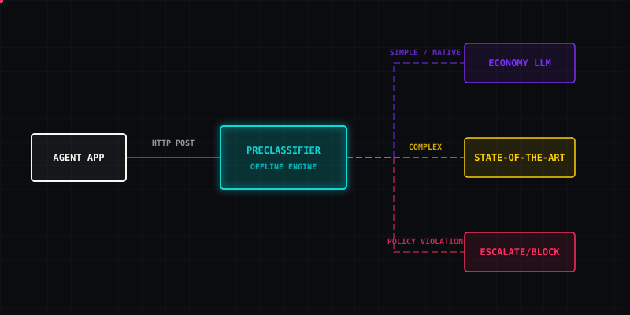

<div align="center">
  
</div>

<div align="center">
  <a href="https://github.com/sasindudilshanranwadana/llm-preclassifier/actions/workflows/ci.yml">
    
  </a>
  <a href="LICENSE">
    
  </a>
  <a href="https://www.python.org/">
    
  </a>
  <a href="Dockerfile">
    
  </a>
</div>

<br>

> **A self-hosted, provider-neutral preflight classifier for agent requests.** 
> Intercept, classify, and route incoming agent tasks _before_ calling a heavy LLM or executing a tool.

<br>

### THE PROBLEM & THE SOLUTION

| ❌ The Problem | 🟩 The Solution |
|---|---|
| Agents send **all** prompts through the same slow, expensive state-of-the-art LLM gateway. | Route **simple** tasks to fast local/economy models, saving tokens and latency. |
| Tool boundaries are granted blindly based on the user's prompt wrapper. | Detect **explicit tool needs** upfront and fail-fast if unauthorized. |
| Black-box gateways obscure _why_ a model was selected. | Get an **inspectable, deterministic, offline** policy decision before execution. |

<br>

## ⚡ ARCHITECTURE

<div align="center">
  
</div>

`llm-preclassifier` is a decision sidecar. It receives your agent's input, applies a configurable standard of rules, and issues a structured routing verdict. **It does not execute tools, forward API keys, or hallucinate.**

<br>

## 🚀 QUICK START

The service is distributed as a hardened, non-root Docker container.

```console
$ docker compose up --build -d
[+] Building 6.2s (13/13) FINISHED
[+] Running 1/1
 ✔ Container llm-preclassifier-runtime-1  Started
```

Check the health status:
```console
$ curl -sS http://127.0.0.1:8802/healthz
{"status":"ok"}
```

<br>

## 📊 DECISION ENGINE (API)

Send a raw prompt array to the `/v1/classify` endpoint. 

**Request:**
```json
curl -X POST http://127.0.0.1:8802/v1/classify \
  -H "Content-Type: application/json" \
  -d '{"messages":[{"role":"user","content":"Summarise this report."}]}'
```

**Verdict:**
```json
{
  "version": "v1",
  "task_type": "summarization",
  "complexity": "simple",
  "tool_requirement": "none",
  "recommended_model_tier": "economy",
  "confidence": 0.88,
  "action": "route",
  "reasons": ["offline_rules_v1"],
  "policy_version": "v1"
}
```

<br>

## ⚙️ CAPABILITIES

> [!NOTE]
> **V0.1 represents the Offline Tier.** Deterministic logic rules are applied in-memory. Zero outbound requests are made to any provider.

<details>
<summary><b>View supported configuration variables</b></summary>
<br>

Configuration is entirely environment-driven. Do not commit `.env` files.

| Variable | Default | Purpose |
|---|---:|---|
| `LLM_PRECLASSIFIER_HOST` | `0.0.0.0` | Bind address. |
| `LLM_PRECLASSIFIER_PORT` | `8802` | Listening port. |
| `LLM_PRECLASSIFIER_LOG_DECISIONS`| `false` | Log classification outcomes (but never prompt content). |
| `LLM_PRECLASSIFIER_CACHE_SIZE` | `1000` | LRU cache capacity. |
| `LLM_PRECLASSIFIER_CACHE_TTL_SECONDS`| `3600` | LRU cache time-to-live. |
| `LLM_PRECLASSIFIER_API_TOKEN` | `""` | Optional static bearer token for the API. |

</details>

<details>
<summary><b>View privacy and security guarantees</b></summary>
<br>

- **In-memory Processing:** Prompts are processed strictly in RAM.
- **Zero Prompt Logging:** `LLM_PRECLASSIFIER_LOG_DECISIONS=true` logs the _decision_ (e.g. `complexity: simple`), but strips all prompt content, user messages, and headers.
- **Hardened Runtime:** The Docker container drops all capabilities (`--cap-drop ALL`), runs read-only (`--read-only`), prevents privilege escalation (`no-new-privileges`), and uses a non-root user.

</details>

<br>

## 📖 PROJECT RESOURCES

- [⚖️ License (Apache 2.0)](LICENSE)
- [🛡️ Security Policy](SECURITY.md)
- [🤝 Contributing Guidelines](CONTRIBUTING.md)
- [📝 Changelog](CHANGELOG.md)

> [!WARNING]
> This service acts as an advisory sidecar. It is **not** a universal security firewall. It does not determine whether a prompt is fundamentally harmless, authorized by identity, or structurally safe against jailbreaks. Apply proper boundary controls at your tool-execution layer.

